# Algoritmo CNN_Visdrone_paso_a_paso.ipynb

# Análisis Vectorial y Matricial de una Red Neuronal Convolucional para Clasificación de Objetos en VisDrone

**Estructura matemática de una CNN implementada con PyTorch**

**Autor:** Antonio Lam G.  
**Afiliación:** Informe técnico doctoral en estadística y aprendizaje profundo  
**Formato:** versión en Markdown compatible con `README.md` de GitHub.

> Nota: GitHub no compila una presentación Beamer completa. Esta conversión preserva el contenido académico, las fórmulas matemáticas renderizables y las referencias a figuras.

## Contenido

- [Introducción: El Espacio Vectorial de las Imágenes](#introduccion-el-espacio-vectorial-de-las-imagenes)
- [Preparación Vectorial de los Datos](#preparacion-vectorial-de-los-datos)
- [El Espacio Vectorial de PyTorch](#el-espacio-vectorial-de-pytorch)
- [Arquitectura Matricial de la CNN](#arquitectura-matricial-de-la-cnn)
- [Optimización Vectorial: Gradiente Descendente](#optimizacion-vectorial-gradiente-descendente)
- [De la Clasificación a la Detección: El Espacio Vectorial de YOLO](#de-la-clasificacion-a-la-deteccion-el-espacio-vectorial-de-yolo)

#### Resumen ejecutivo

En el presente informe se presenta un análisis vectorial y matricial meticuloso del notebook `cnn_visdrone_paso_paso.ipynb`. Se descompone cada etapa del flujo de trabajo de una Red Neuronal Convolucional (CNN) en sus componentes fundamentales de álgebra lineal: espacios vectoriales, transformaciones lineales, productos punto, productos matriciales, y operaciones de reducción de dimensionalidad. Se proporcionan representaciones gráficas 3D para ilustrar la geometría de los espacios de características y la dinámica del gradiente descendente. El análisis se realiza desde la perspectiva de un Doctor en Estadística Matemática, enfatizando la estructura matemática subyacente que permite a la CNN aprender representaciones jerárquicas de los datos visuales, y cómo esta comprensión vectorial es esencial para la transición hacia modelos de detección de objetos como YOLO.

## Introducción: El Espacio Vectorial de las Imágenes

> **Panorama: Panorama del capítulo**
>

El notebook `cnn_visdrone_paso_paso.ipynb` constituye una exploración fundamental del aprendizaje profundo aplicado a la visión por computadora. Su objetivo principal es construir una Red Neuronal Convolucional (CNN) desde cero para clasificar objetos del dataset VisDrone, estableciendo un puente conceptual hacia sistemas de detección de objetos como YOLO. Para comprender verdaderamente el funcionamiento de esta red, es imperativo descomponer cada operación en sus componentes matemáticos subyacentes: vectores, matrices, transformaciones lineales y espacios vectoriales.

### Representación Vectorial de una Imagen

Una imagen digital en color se representa naturalmente como un tensor tridimensional. Sin embargo, para el análisis matemático, es conveniente vectorizarla. Una imagen de tamaño $H \times W$ con $C$ canales (RGB) puede ser vista como un vector en un espacio de alta dimensión:

$$
\mathbf{x} \in \mathbb{R}^{C \times H \times W} \quad \text{o vectorizado como} \quad \mathbf{x} \in \mathbb{R}^{C \cdot H \cdot W}
$$

Para una imagen de $96 \times 96$ píxeles con 3 canales, tenemos $\mathbf{x} \in \mathbb{R}^{27648}$. Cada píxel $x_{c,i,j}$ representa una coordenada en este espacio de 27\,648 dimensiones.

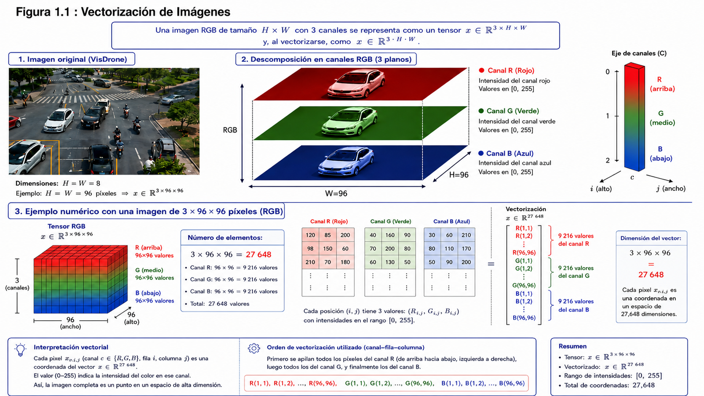

### Geometría del Espacio de Características

El objetivo de una CNN es aprender una transformación que mapee el espacio de entrada de alta dimensión a un espacio de características donde las clases sean linealmente separables o fácilmente distinguibles. Cada capa de la red aplica una transformación no lineal que deforma y reconfigura este espacio.

$$
f: \mathbb{R}^{C \times H \times W} \to \mathbb{R}^{d}
$$

Donde $d$ es la dimensionalidad del espacio de características final (en nuestro caso, $d=10$ para las 10 clases). Esta función $f$ se compone de una secuencia de transformaciones lineales (convoluciones, capas lineales) y no lineales (ReLU, MaxPooling).

#### Mapeo del Espacio de Entrada al Espacio de Características

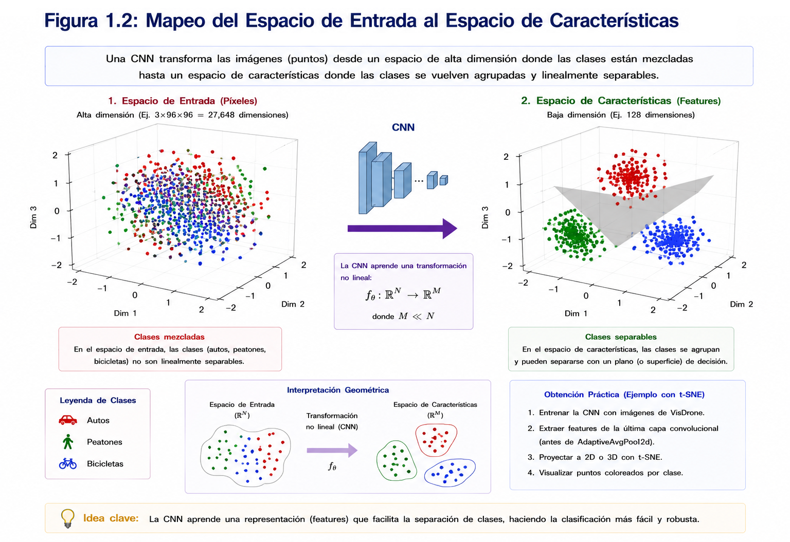

> **Nota**
>

**Figura 1.2: Mapeo del Espacio de Entrada al Espacio de Características.** \

La CNN aprende una función no lineal que transforma el espacio de entrada (imágenes) en un espacio de características de menor dimensionalidad donde las clases están separadas. La superficie de decisión es aprendida durante el entrenamiento.

### Ventaja de PyTorch en el Espacio Vectorial

PyTorch se destaca sobre otras librerías como NumPy por su capacidad para operar eficientemente en estos espacios vectoriales de alta dimensión mediante:

1. **Cómputo Diferenciable (Autograd):** PyTorch construye un grafo computacional dinámico que permite calcular gradientes de forma automática.
2. **Aceleración por GPU:** Las operaciones matriciales y tensoriales se ejecutan en paralelo en GPUs.

La representación de datos como `Tensor`s en PyTorch es análoga a trabajar con vectores y matrices en un sentido matemático, pero con la ventaja de que las operaciones son altamente optimizadas y diferenciables.

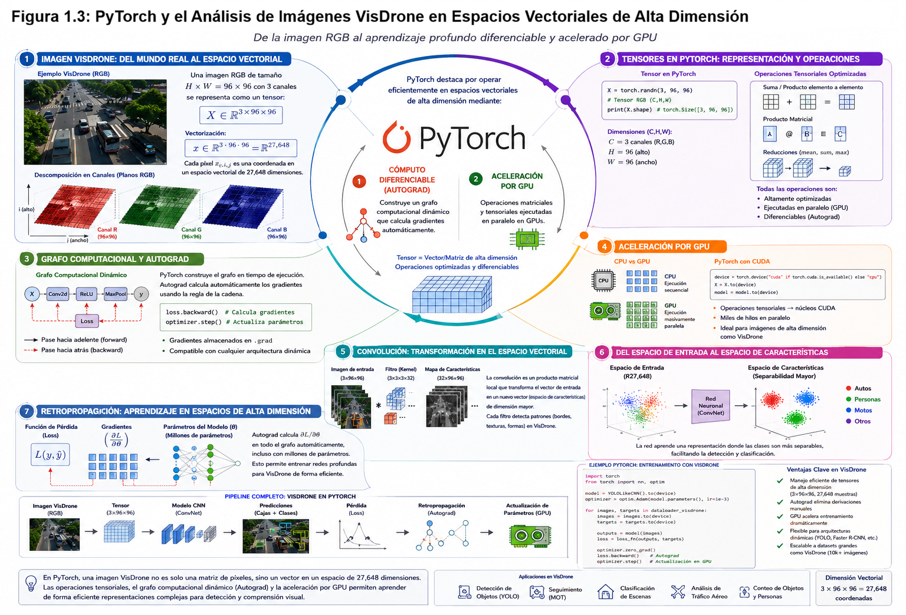

> **Nota**
>

**Figura 1.3: Ventaja de PyTorch en el Espacio Vectorial.**
\

Para VisDrone, PyTorch actúa como una plataforma de álgebra tensorial diferenciable. Permite representar cada imagen como un tensor de alta dimensión, transformar ese tensor mediante convoluciones, calcular automáticamente gradientes con Autograd y aprovechar el paralelismo de la GPU. La combinación de estas propiedades hace viable el entrenamiento de modelos profundos capaces de extraer patrones visuales complejos a partir de escenas aéreas densas y heterogéneas.

## Preparación Vectorial de los Datos

> **Panorama: Panorama del capítulo**
>

La preparación de los datos es el primer paso donde se transforma el espacio de las imágenes anotadas en un espacio vectorial estructurado para el aprendizaje automático.

### De la Caja Delimitadora al Vector de Características

El proceso implementado en la clase `VisDroneCropsDataset` realiza las siguientes operaciones vectoriales:

 Recorte (Crop)

Para cada anotación con coordenadas $(x_1, y_1, x_2, y_2)$, se extrae una submatriz de la imagen original:

$$
\mathbf{X}_{\text{recorte}} = \mathbf{X}[y_1:y_2, x_1:x_2, :] \in \mathbb{R}^{3 \times h \times w}
$$

 Redimensionamiento (Resize)

El recorte se redimensiona a $S \times S$ ($S=96$). Este es un mapeo no lineal del espacio de recortes de tamaño variable al espacio fijo:

$$
\text{Resize}: \mathbb{R}^{3 \times h \times w} \to \mathbb{R}^{3 \times S \times S}
$$

 Normalización y Conversión a Tensor

La normalización escala el espacio vectorial al rango $[0,1]$:

$$
\mathbf{X}_{\text{norm}} = \frac{\mathbf{X}_{\text{recorte}}}{255.0} \in [0,1]^{3 \times S \times S}
$$

Finalmente, la permutación de dimensiones reorganiza el espacio:

$$
\text{Permute}: \mathbb{R}^{H \times W \times C} \to \mathbb{R}^{C \times H \times W}
$$

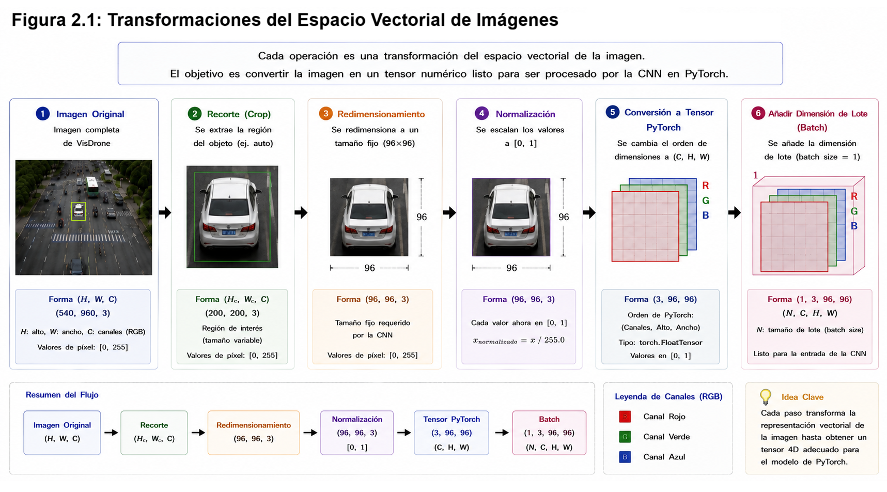

> **Nota**
>

**Figura 2.1: Transformaciones del Espacio Vectorial de Imágenes.** Una imagen se recorta, redimensiona, normaliza y se convierte en un tensor de PyTorch. Cada operación es una transformación del espacio vectorial original al espacio de entrada de la red.

### Estructura del Lote (Batch)

El `DataLoader` agrupa múltiples muestras en un lote, creando un tensor de 4 dimensiones:

$$
\mathbf{X}_{\text{batch}} \in \mathbb{R}^{B \times C \times H \times W}
$$

Donde $B$ es el tamaño del lote. Esto permite la vectorización de las operaciones, procesando $B$ vectores de entrada simultáneamente.

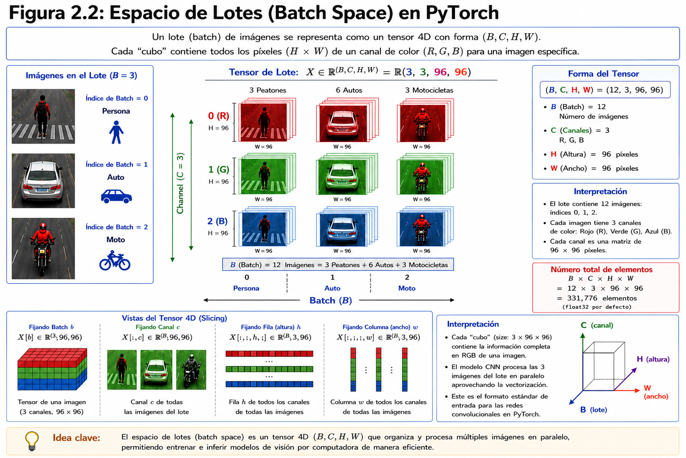

> **Nota**
>

**Figura 2.2: Espacio de Lotes (Batch Space).** Un lote de imágenes se representa como un tensor 4D. La primera dimensión es el índice de la muestra en el lote. Las operaciones se vectorizan a lo largo de esta dimensión.

## El Espacio Vectorial de PyTorch

> **Panorama: Panorama del capítulo**
>

PyTorch implementa un espacio vectorial tensorial que generaliza los conceptos de vectores y matrices a dimensiones superiores. Este capítulo explora la naturaleza vectorial de las operaciones fundamentales en PyTorch.

### Tensores como Vectores y Matrices

Un tensor de PyTorch puede ser visto como un vector en un espacio de alta dimensión o como una matriz cuando se considera su forma (shape).

- **Tensor 1D:** Vector $\mathbf{v} \in \mathbb{R}^n$
- **Tensor 2D:** Matriz $\mathbf{M} \in \mathbb{R}^{m \times n}$
- **Tensor 3D:** Arreglo de matrices o un cubo de datos $\mathbf{T} \in \mathbb{R}^{c \times h \times w}$

### Operaciones Vectoriales en PyTorch

Las operaciones fundamentales en PyTorch son extensiones de las operaciones vectoriales y matriciales clásicas.

 Producto Punto (Dot Product)

El producto punto entre dos vectores se realiza con la función `torch.dot` o mediante el operador `@` para matrices:

$$
\mathbf{a} \cdot \mathbf{b} = \sum_{i=1}^{n} a_i b_i = \mathbf{a}^T \mathbf{b}
$$

 Producto Matricial (Matrix Multiplication)

El producto de matrices se realiza con `torch.mm` o `@`:

$$
\mathbf{C} = \mathbf{A} \mathbf{B} \quad \text{donde} \quad C_{i,j} = \sum_{k=1}^{m} A_{i,k} B_{k,j}
$$

 Broadcasting

El broadcasting es una extensión de las operaciones vectoriales que permite operar con tensores de diferentes formas, replicando automáticamente los datos a lo largo de dimensiones faltantes.

#### Convolución como producto matricial con matriz de Toeplitz

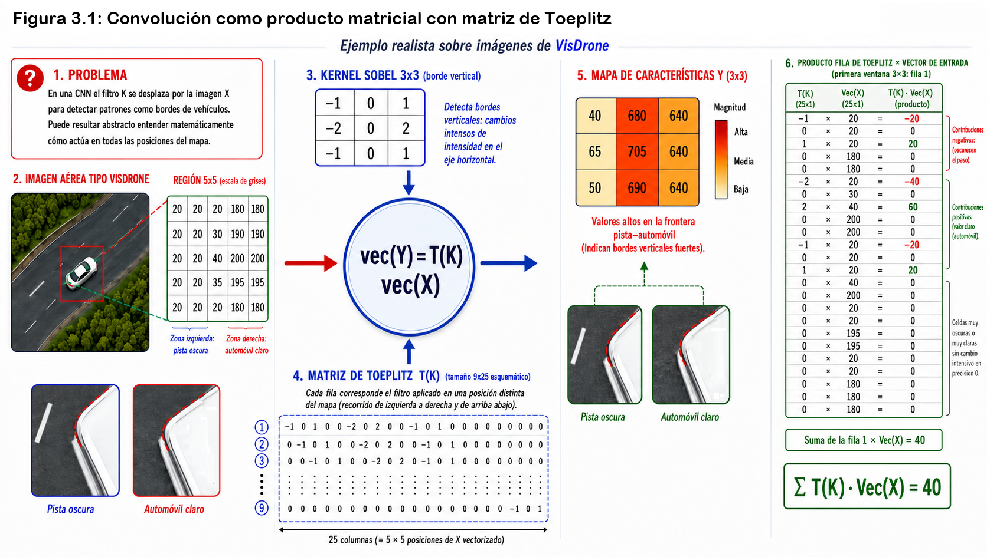

> **Nota**
>

**Figura 3.1: Convolución como producto matricial con matriz de Toeplitz.**

Cada fila de la matriz de Toeplitz $T(K)$ representa el kernel aplicado en una posición distinta de la imagen. Al multiplicar $T(K)$ por la imagen vectorizada $vec(X)$, cada fila produce un valor del mapa de características. Los nueve resultados obtenidos se reorganizan para formar la matriz $Y^33$.

### Espacio Vectorial de Parámetros

Los parámetros de la red, $\boldsymbol{\theta}$, viven en un espacio de alta dimensión $\mathbb{R}^P$, donde $P$ es el número total de parámetros entrenables.

$$
\boldsymbol{\theta} \in \mathbb{R}^P
$$

Cada punto en este espacio representa una configuración completa de la CNN. El entrenamiento es un proceso de búsqueda en este espacio de alta dimensión para encontrar el punto que minimiza la función de pérdida.

#### Espacio de Par\'ametros de la CNN

> **Nota**
>

**Figura 3.2: Espacio de Parámetros de la CNN.** Cada punto en este espacio de alta dimensión representa una instancia de la CNN con pesos y sesgos específicos. El entrenamiento busca el punto que minimiza la función de pérdida.

### Computación Vectorizada

La vectorización es la clave de la eficiencia en PyTorch. En lugar de procesar una muestra a la vez, se procesan lotes completos:

$$
\mathbf{Y}_{\text{batch}} = f(\mathbf{X}_{\text{batch}})
$$

Donde $f$ se aplica a cada elemento del lote en paralelo. Esto es posible gracias a la naturaleza vectorial de las operaciones.

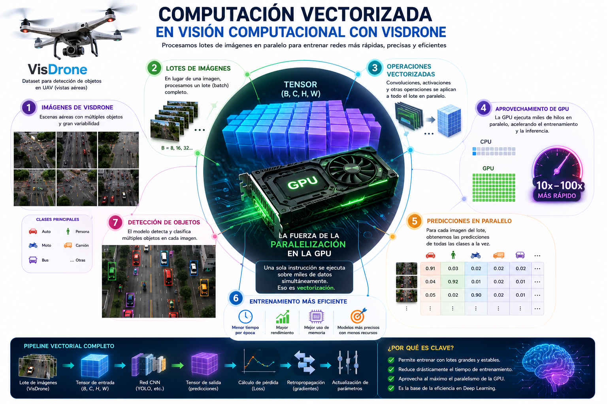

## Arquitectura Matricial de la CNN

> **Panorama: Panorama del capítulo**
>

La CNN implementada en el notebook es una secuencia de capas convolucionales y de agrupamiento. Cada capa realiza transformaciones vectoriales que mapean el espacio de entrada a un nuevo espacio de características.

### La Capa Convolucional como Transformación Lineal

La capa convolucional `nn.Conv2d` es el corazón de la CNN. Aunque no es una transformación lineal en el sentido estricto debido a la no linealidad de la activación (ReLU), su componente fundamental (la convolución) es una operación lineal.

 Convolución como Producto Matricial

La operación de convolución puede ser expresada como un producto matricial. Sea $\mathbf{X}$ la imagen de entrada y $\mathbf{W}$ un filtro (kernel). La convolución $\mathbf{Y} = \mathbf{W} * \mathbf{X}$ puede ser representada como:

$$
\mathbf{Y} = \mathbf{W}_{\text{toeplitz}} \cdot \mathbf{X}_{\text{vec}}
$$

Donde $\mathbf{W}_{\text{toeplitz}}$ es una matriz de Toeplitz (o bloque-circulante) que representa el filtro, y $\mathbf{X}_{\text{vec}}$ es el vector de entrada.

#### Convolucional como Transformación Lineal

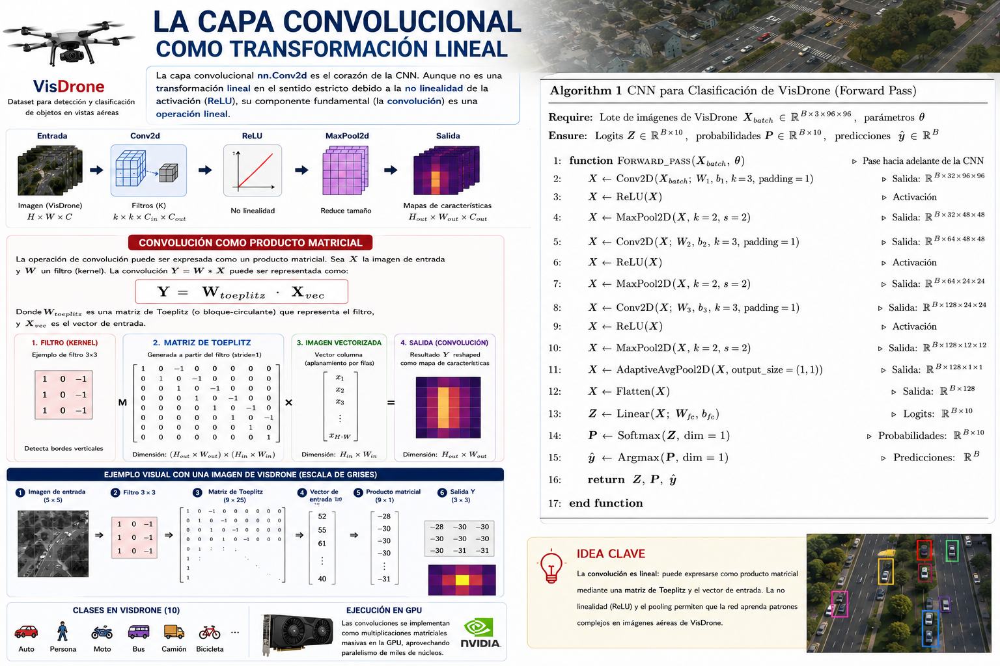

> **Nota**
>

**Figura 4.1: Convolución como Producto Matricial.** La convolución 2D se puede descomponer en un producto matriz-vector. La matriz de Toeplitz contiene los pesos del filtro, y el vector contiene los píxeles de la imagen. Este es un ejemplo de cómo una operación de deslizamiento se convierte en álgebra lineal.

Producto Punto en la Convolución

Para cada posición $(i,j)$, la convolución calcula el producto punto entre el filtro $\mathbf{W}$ (vectorizado) y la ventana de la imagen $\mathbf{X}_{i,j}$ (vectorizada):

$$
y_{i,j} = \langle \text{vec}(\mathbf{W}), \text{vec}(\mathbf{X}_{i,j}) \rangle + b
$$

Este es el producto punto clásico entre dos vectores en $\mathbb{R}^{K^2}$.

 Representación Matricial Completa de la Capa

Para una capa convolucional con $C_{\text{in}}$ canales de entrada y $C_{\text{out}}$ filtros:

$$
\mathbf{Y}^{(k)} = \sigma \left( \sum_{c=1}^{C_{\text{in}}} \mathbf{W}^{(k,c)} * \mathbf{X}^{(c)} + b^{(k)} \right)
$$

Donde $\mathbf{W}^{(k,c)}$ es el filtro $k$ para el canal de entrada $c$. En forma matricial:

$$
\mathbf{Y}_{\text{vec}} = \sigma \left( \mathbf{W}_{\text{conv}} \mathbf{X}_{\text{vec}} + \mathbf{b}_{\text{vec}} \right)
$$

Donde $\mathbf{W}_{\text{conv}}$ es una matriz que contiene todos los filtros en una estructura de bloques.

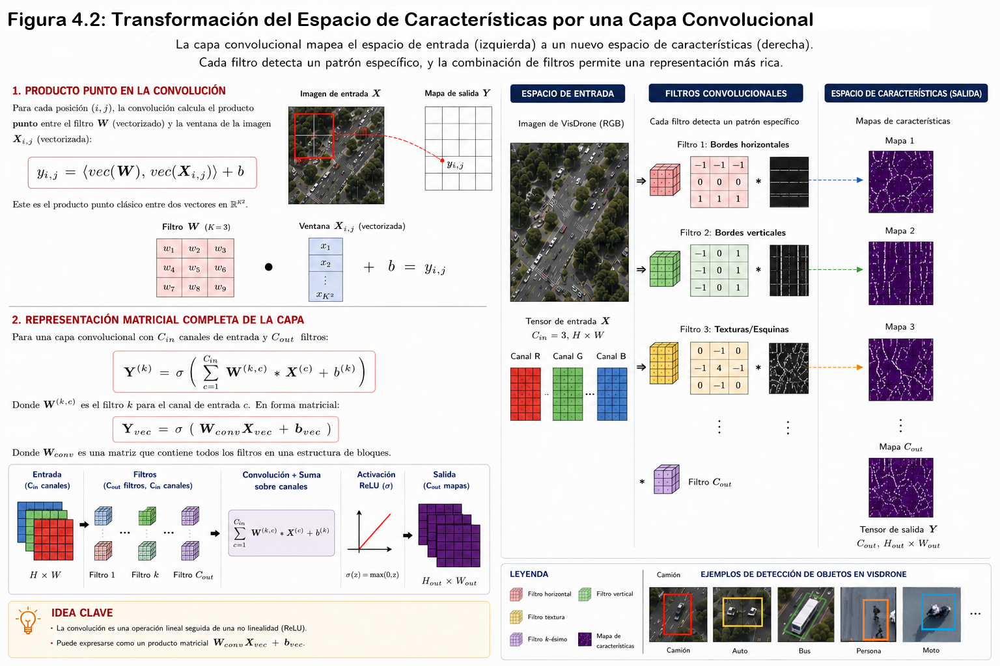

> **Nota**
>

**Figura 4.2: Transformación del Espacio de Características por una Capa Convolucional.** La capa convolucional mapea el espacio de entrada (izquierda) a un nuevo espacio de características (derecha). Cada filtro detecta un patrón específico, y la combinación de filtros permite una representación más rica.

### Capa de Agrupamiento Máximo (MaxPooling)

El `MaxPool2d` reduce la dimensionalidad espacial. Para una ventana de $2 \times 2$, la operación es:

$$
y_{i,j} = \max\{ x_{2i,2j}, x_{2i+1,2j}, x_{2i,2j+1}, x_{2i+1,2j+1} \}
$$

Esta es una operación de reducción de dimensionalidad no lineal que preserva las características más prominentes.

 Reducción de Dimensionalidad en el Espacio Vectorial

El MaxPooling reduce la dimensionalidad del espacio de características de $\mathbb{R}^{C \times H \times W}$ a $\mathbb{R}^{C \times H/2 \times W/2}$.

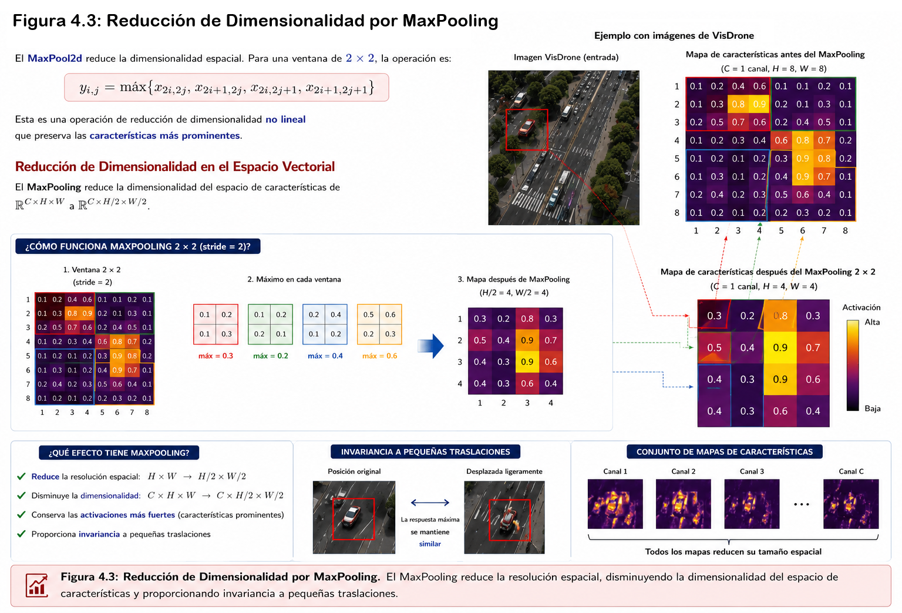

> **Nota**
>

**Figura 4.3: Reducción de Dimensionalidad por MaxPooling.** El MaxPooling reduce la resolución espacial, disminuyendo la dimensionalidad del espacio de características y proporcionando invariancia a pequeñas traslaciones.

### Secuencia de Transformaciones Vectoriales

La CNN completa es una composición de transformaciones:

$$
\begin{gathered}
\mathbf{h}_0 =
\sigma_0\left(\mathbf{W}_1 * \mathbf{x} + \mathbf{b}_1\right),\\
\mathbf{h}_1 =
\sigma_1\left(\mathrm{Pool}_1(\mathbf{h}_0)\right),\\
\mathbf{h}_2 =
\sigma_2\left(\mathrm{Pool}_2(\mathbf{h}_1)\right),\\
\mathbf{h}_3 =
\sigma_3\left(\mathrm{Pool}_3(\mathbf{h}_2)\right),\\
f(\mathbf{x}) =
\mathbf{W}_{\mathrm{fc}}\mathbf{h}_3 + \mathbf{b}_{\mathrm{fc}}.
\end{gathered}
$$
  

Cada $\sigma_k$ es la función ReLU, y cada $\text{Pool}_k$ es MaxPooling.

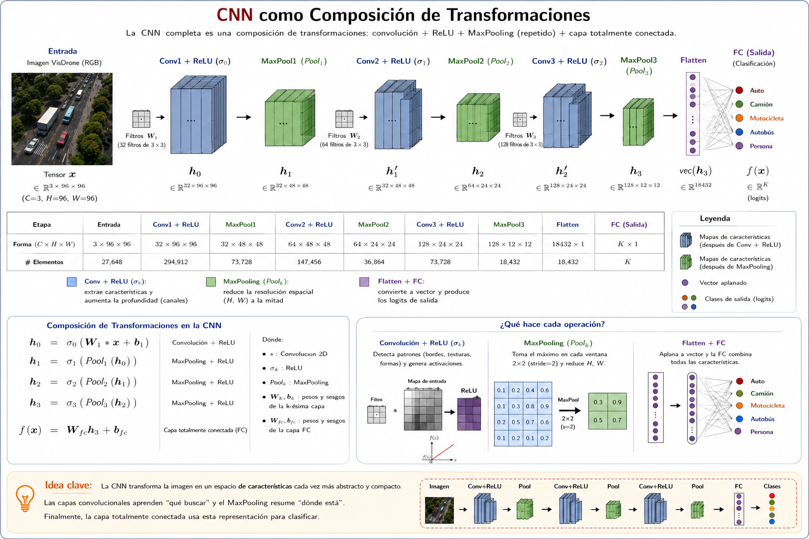

> **Nota**
>

**Figura 4.4: Espacio Vectorial a través de las Capas de la CNN.** Visualización de cómo el espacio de características se transforma a través de las capas convolucionales y de pooling. La dimensionalidad espacial se reduce mientras que la profundidad (número de canales) aumenta.

### Extracción de Características y el Espacio de Características

El poder de una CNN reside en su capacidad para aprender características jerárquicas. Las capas tempranas aprenden características de bajo nivel (bordes, colores), mientras que las capas profundas aprenden características de alto nivel (partes de objetos, objetos completos).

$$
\begin{gathered}
\mathrm{Capa\ 1:}
\qquad
\mathbf{x}\longrightarrow\mathbf{h}_1
\qquad
\text{características de bajo nivel},
\\
\mathrm{Capa\ 2:}
\qquad
\mathbf{h}_1\longrightarrow\mathbf{h}_2
\qquad
\text{características de nivel medio},
\\
\mathrm{Capa\ 3:}
\qquad
\mathbf{h}_2\longrightarrow\mathbf{h}_3
\qquad
\text{características de alto nivel}.
\end{gathered}
$$

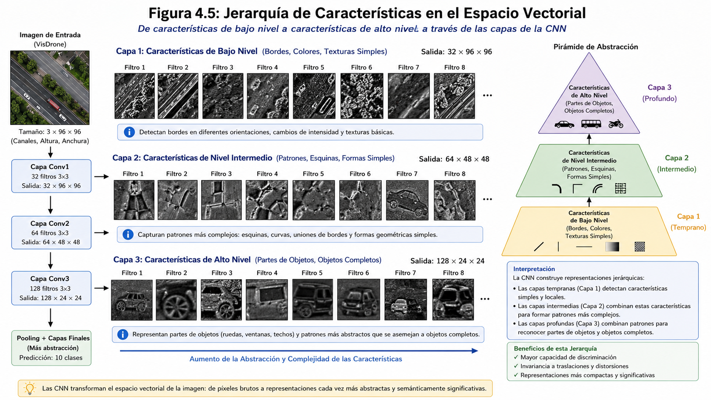

> **Nota**
>

**Figura 4.5: Jerarquía de Características en el Espacio Vectorial.** Cada capa de la CNN aprende una representación más abstracta de la entrada. El espacio de características se transforma progresivamente, aprendiendo características cada vez más complejas.

### Importancia de los Features en el Espacio Vectorial

Los *features* son las coordenadas en el espacio de características aprendido. La calidad de estos *features* determina el rendimiento de la red. La CNN ajusta sus parámetros para que los *features* de diferentes clases estén bien separados en el espacio de características, facilitando la clasificación.

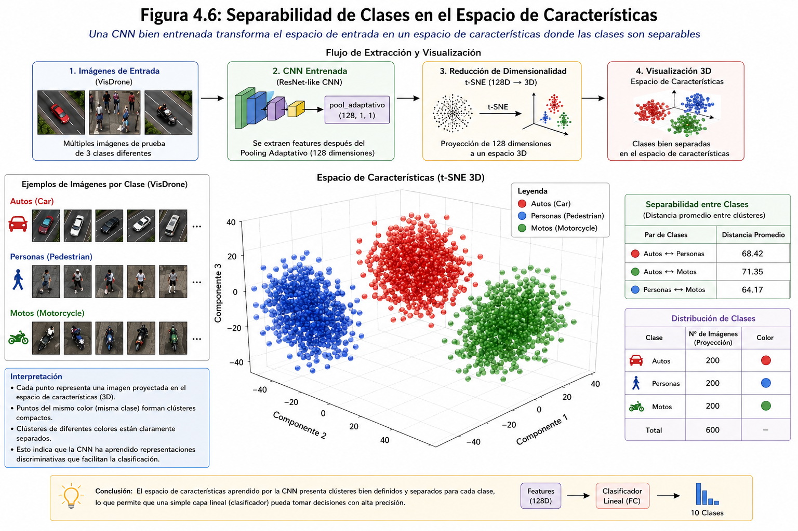

> **Nota**
>

**Figura 4.6: Separabilidad de Clases en el Espacio de Características.** Una buena CNN transforma el espacio de entrada de modo que las diferentes clases estén separadas linealmente o sean fácilmente distinguibles en el espacio de características final.

## Optimización Vectorial: Gradiente Descendente

> **Panorama: Panorama del capítulo**
>

El entrenamiento de una CNN es un problema de optimización en el espacio de parámetros $\mathbb{R}^P$. La función objetivo es la pérdida empírica.

### La Función de Pérdida como Superficie en \texorpdfstring{\(\mathbb{R

^P\)R elevado a P

La función de pérdida $J(\boldsymbol{\theta})$ mapea cada punto en el espacio de parámetros a un escalar:

$$
J: \mathbb{R}^P \to \mathbb{R}
$$

Esta función define una superficie (o hipersuperficie) en $\mathbb{R}^{P+1}$. El objetivo es encontrar el mínimo de esta superficie.

^P\)R elevado a P

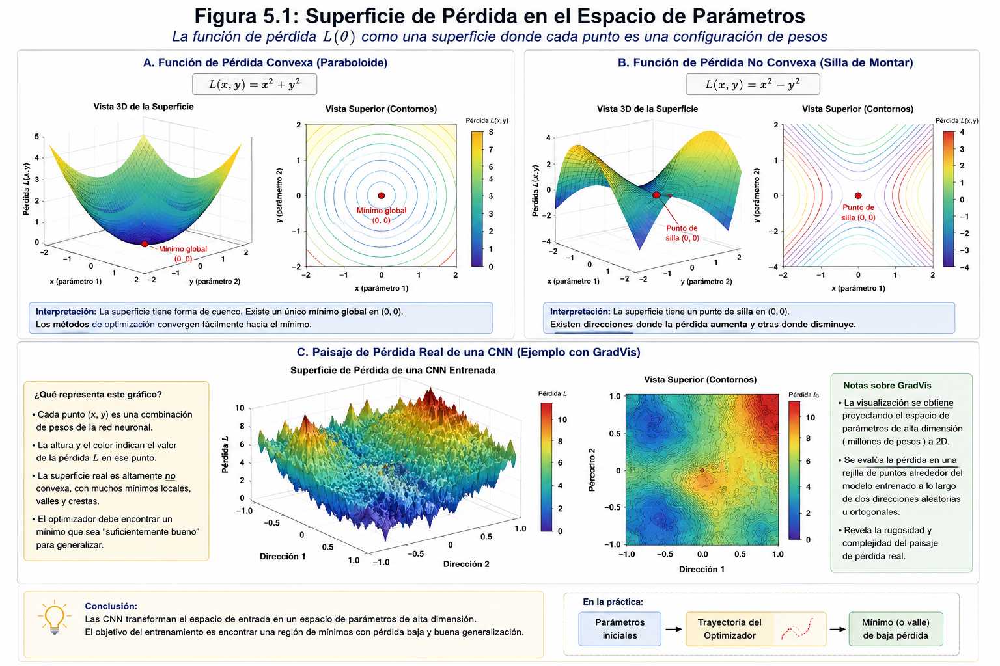

^P\)R elevado a P

> **Nota**
>

**Figura 5.1: Superficie de Pérdida en el Espacio de Parámetros.** La función de pérdida define una superficie en el espacio de parámetros. Los mínimos locales y globales corresponden a buenas configuraciones de la red.

### El Gradiente como Vector en \texorpdfstring{\(\mathbb{R

^P\)R elevado a P

El gradiente de la pérdida con respecto a los parámetros es un vector en el espacio de parámetros:

$$
\nabla_{\boldsymbol{\theta}} J(\boldsymbol{\theta}) = \begin{bmatrix}
        \frac{\partial J}{\partial \theta_1} \\
        \frac{\partial J}{\partial \theta_2} \\
        \vdots \\
        \frac{\partial J}{\partial \theta_P}
    \end{bmatrix} \in \mathbb{R}^P
$$

Cada componente del gradiente indica la dirección y magnitud del cambio en la pérdida con respecto a ese parámetro específico.

^P\)R elevado a P

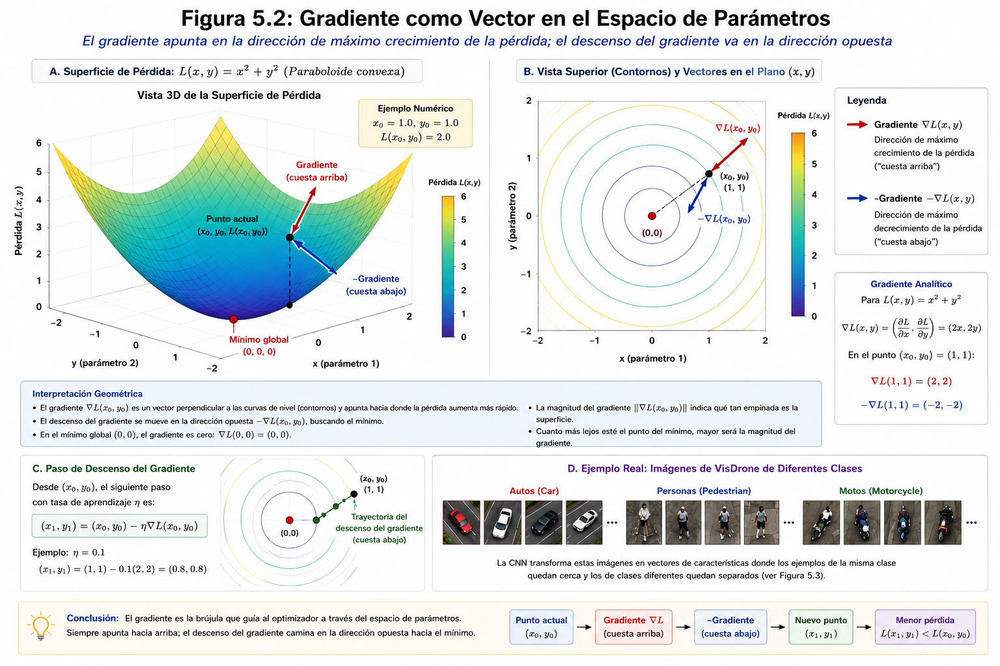

^P\)R elevado a P

> **Nota**
>

**Figura 5.2: Gradiente como Vector en el Espacio de Parámetros.** El gradiente es un vector que apunta en la dirección de máximo crecimiento de la función de pérdida. Para minimizar, nos movemos en la dirección opuesta.

### Actualización de Parámetros como Operación Vectorial

La regla de actualización del gradiente descendente es:

$$
\boldsymbol{\theta}_{t+1} = \boldsymbol{\theta}_t - \eta \nabla_{\boldsymbol{\theta}} J(\boldsymbol{\theta}_t)
$$

Esta es una operación vectorial en $\mathbb{R}^P$: restar un vector (el gradiente escalado) de otro vector (los parámetros actuales).

 Interpretación Geométrica

Cada paso del gradiente descendente mueve el punto representativo en el espacio de parámetros en la dirección de máxima pendiente negativa, descendiendo por la superficie de pérdida.

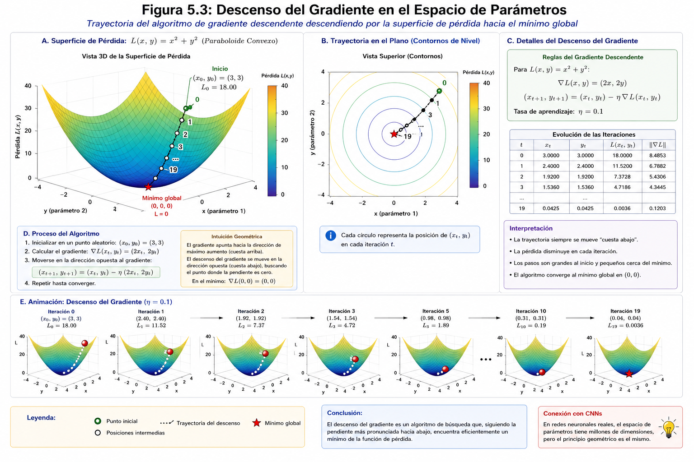

> **Nota**
>

**Figura 5.3: Descenso del Gradiente en el Espacio de Parámetros.** Visualización del proceso de descenso del gradiente. Los puntos representan las iteraciones, moviéndose hacia un mínimo de la superficie de pérdida. La trayectoria muestra la evolución de los parámetros durante el entrenamiento.

### Adam: Optimización con Momentos

Adam (Adaptive Moment Estimation) es una extensión del gradiente descendente que utiliza momentos de primer y segundo orden para adaptar la tasa de aprendizaje para cada parámetro.

$$
\mathbf{m}_t =
\beta_1\mathbf{m}_{t-1}
+
(1-\beta_1)
\nabla_{\boldsymbol{\theta}}
J(\boldsymbol{\theta}_t)
$$

$$
\mathbf{v}_t =
\beta_2\mathbf{v}_{t-1}
+
(1-\beta_2)
\left(
\nabla_{\boldsymbol{\theta}}
J(\boldsymbol{\theta}_t)
\right)^2
$$

$$
\hat{\mathbf{m}}_t =
\frac{\mathbf{m}_t}{1-\beta_1^t}
$$

$$
\hat{\mathbf{v}}_t =
\frac{\mathbf{v}_t}{1-\beta_2^t}
$$

$$
\boldsymbol{\theta}_{t+1} = \boldsymbol{\theta}_t - \eta \frac{\hat{\mathbf{m}}_t}{\sqrt{\hat{\mathbf{v}}_t} + \epsilon}
$$

Cada operación es vectorial en $\mathbb{R}^P$.

#### Figura 5.4: Comparación de Trayectorias de Optimización.

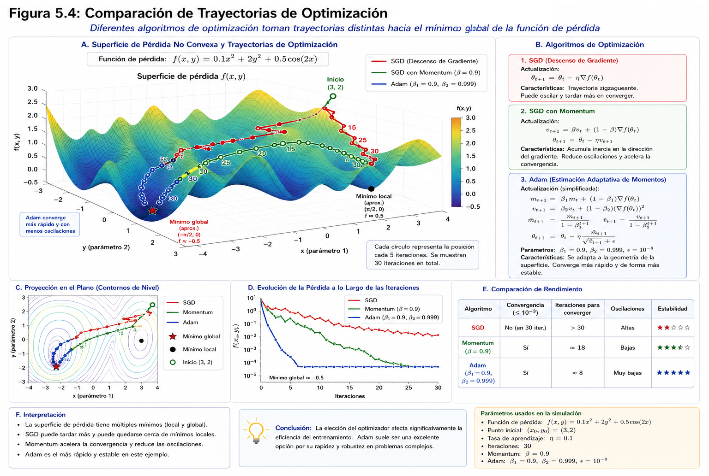

#### Actualización de Parámetros como Operación Vectorial

> **Nota**
>

**Figura 5.4: Comparación de Trayectorias de Optimización.** Diferentes algoritmos de optimización (SGD, Adam) toman diferentes trayectorias en el espacio de parámetros. Adam a menudo converge más rápidamente y con mayor estabilidad.

### Backpropagation: Cálculo Vectorial del Gradiente

La retropropagación es una aplicación eficiente de la regla de la cadena para calcular el gradiente en el espacio de parámetros.

$$
\frac{\partial J}{\partial \theta^{(l)}_{i,j}} = \sum_{k} \frac{\partial J}{\partial z^{(l+1)}_k} \frac{\partial z^{(l+1)}_k}{\partial \theta^{(l)}_{i,j}}
$$

Donde $\theta^{(l)}_{i,j}$ es un parámetro en la capa $l$, y $z^{(l+1)}$ es la salida de la capa $l+1$. Cada término en la suma es un producto escalar de vectores.

#### Figura 5.5: Flujo de Gradientes en la Retropropagación.

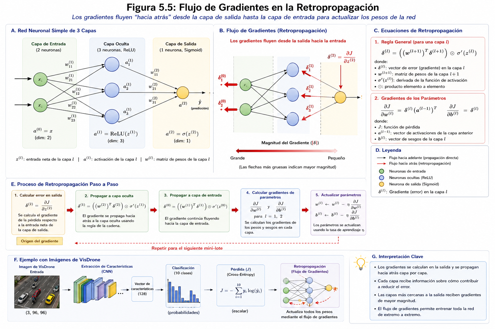

#### Actualización de Parámetros como Operación Vectorial

> **Nota**
>

**Figura 5.5: Flujo de Gradientes en la Retropropagación.** Los gradientes fluyen desde la capa de salida hacia atrás a través de la red, calculando las derivadas parciales en cada capa. Esto es un proceso vectorial a través del grafo computacional.

## De la Clasificación a la Detección: El Espacio Vectorial de YOLO

> **Panorama: Panorama del capítulo**
>

La comprensión de la CNN como un sistema de transformaciones vectoriales es el fundamento para entender modelos de detección de objetos como YOLO.

### La CNN como Backbone Vectorial

En YOLO, la CNN (el backbone) transforma la imagen de entrada en un mapa de características que codifica información espacial y semántica.

$$
\mathbf{X}_{\text{imagen}} \in \mathbb{R}^{3 \times H \times W} \xrightarrow{\text{Backbone CNN}} \mathbf{F} \in \mathbb{R}^{C \times H' \times W'}
$$

Donde $\mathbf{F}$ es el mapa de características, una representación vectorial de la imagen en un espacio de características donde cada "celda" contiene información sobre la región correspondiente de la imagen.

### Predicciones de YOLO como Vectores

Para cada celda $c$ en el mapa de características, YOLO predice:

- $p_{\text{obj}}$: Probabilidad de presencia de objeto (escalar)
- $(t_x, t_y, t_w, t_h)$: Coordenadas de la caja delimitadora (vector en $\mathbb{R}^4$)
- $\mathbf{p}_{\text{class}}$: Probabilidades de clase (vector en $\mathbb{R}^{10}$)

La salida de YOLO es un tensor $\mathbf{Y} \in \mathbb{R}^{H' \times W' \times (5 + 10)}$, donde cada celda produce un vector en $\mathbb{R}^{15}$. La pérdida de YOLO combina términos de clasificación y regresión:

$$
J_{\text{YOLO}} = \lambda_{\text{coord}}\sum_i\sum_j \mathbf{1}_{ij}^{\text{obj}} \left\lVert \text{box}_{ij} -\widehat{\text{box}}_{ij}\right\rVert^2 + \sum_i\sum_j\mathbf{1}_{ij}^{\text{obj}} \left\lVert\mathbf{p}_{ij} -\widehat{\mathbf{p}}_{ij}\right\rVert^2+\cdots .
$$

#### Figura 6.1: YOLO en el Espacio Vectorial.

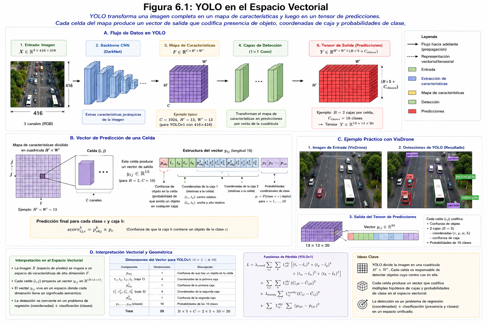

#### YOLO en el Espacio Vectorial

> **Nota**
>

**Figura 6.1: YOLO en el Espacio Vectorial.** La imagen se transforma en un mapa de características. Cada celda de este mapa es un vector que codifica información sobre la presencia de objetos, su ubicación y su clase.

### El Espacio Vectorial de las Cajas Delimitadoras

Las cajas delimitadoras se representan como vectores en $\mathbb{R}^4$: $(x, y, w, h)$ o $(t_x, t_y, t_w, t_h)$ en YOLO. La pérdida de localización es una norma en este espacio, típicamente la norma L2 (error cuadrático medio) o una combinación de pérdidas.

$$
\text{BoxLoss} = \| \mathbf{b} - \hat{\mathbf{b}} \|^2 = (x - \hat{x})^2 + (y - \hat{y})^2 + (w - \hat{w})^2 + (h - \hat{h})^2
$$

#### Figura 6.2: Espacio de las Cajas Delimitadoras.

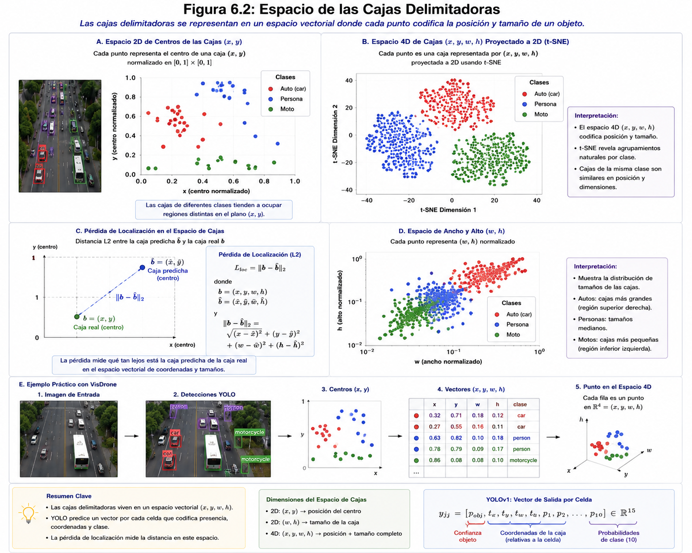

#### YOLO en el Espacio Vectorial

> **Nota**
>

**Figura 6.2: Espacio de las Cajas Delimitadoras.** Cada caja es un punto en $\mathbb{R}^4$. La pérdida de localización mide la distancia entre la caja predicha y la caja real en este espacio.

### Conclusión

El análisis vectorial y matricial del notebook `cnn_visdrone_paso_paso.ipynb` revela la estructura matemática subyacente de las CNNs. Cada operación, desde la preparación de datos hasta la optimización, es una transformación en un espacio vectorial de alta dimensión. Esta comprensión es esencial para:

1. **Depuración e Interpretación:** Entender por qué una red se comporta de cierta manera.
2. **Diseño de Arquitecturas:** Crear nuevas arquitecturas basadas en principios de álgebra lineal.
3. **Transición a Modelos Avanzados:** Aplicar el mismo marco vectorial para comprender YOLO y otros modelos de detección de objetos.

La capacidad de PyTorch para operar en estos espacios vectoriales de manera eficiente y diferenciable es la clave que permite el desarrollo de modelos de aprendizaje profundo a gran escala.

#### Figura 6.3: Del Espacio de Características a la Detección.

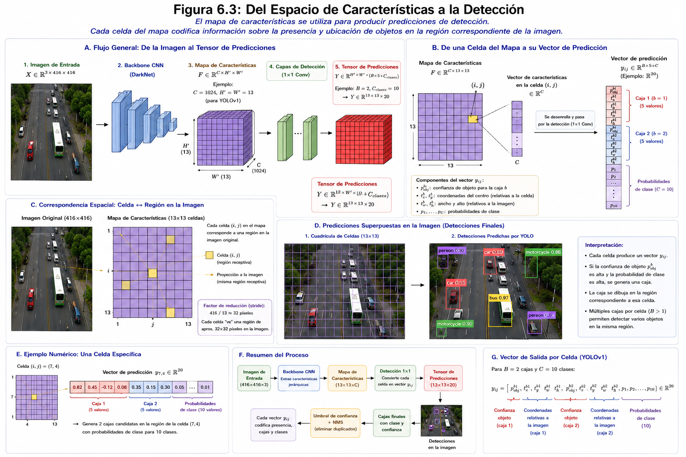

#### YOLO en el Espacio Vectorial

> **Nota**
>

**Figura 6.3: Del Espacio de Características a la Detección.** El espacio de características aprendido por la CNN se utiliza como base para la detección de objetos. Cada celda del mapa de características produce un vector de predicción que codifica la presencia y ubicación de objetos.
